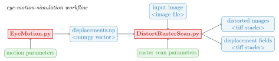

# Eye motion simulation

The eye-motion-simulation framework fulfills two purposes: Simulation of eye motion and generation of accordingly distorted images using an arbitrary raster scan pattern.

It is intended for the evaluation of retrospective OCT / SLO motion correction algorithms, which, without simulation, would need to be evaluated without known ground truth displacements.

The framework is currently limited to transverse drift eye motion. The details are described in the following publication:  
> Nau M.A., Ploner S.B., Moult E.M., Fujimoto J.G., Maier A.K. (2020)  
> **Open Source Simulation of Fixational Eye Drift Motion in OCT Scans.**  
> _Bildverarbeitung für die Medizin 2020_. Informatik aktuell. Springer Vieweg, Wiesbaden  
> [https://link.springer.com/chapter/10.1007/978-3-658-29267-6_56](https://link.springer.com/chapter/10.1007/978-3-658-29267-6_56)

By using the methodology or any code from this repository in a scientific publication, you agree to give adequate reference by citing the above mentioned paper. You are welcome to contact the authors if you have questions, see the email address in the publication.

## Installation

Any recent Python 3 version should do, Python 3.8.1 is tested. To install the required packages, use `pip install -r requirements.txt`.

## Typical workflow

The framework is used in a two-step process:

1.  First, `EyeMotion.py` is used to generate displacements along time.

2.  Subsequently, `DistortRasterScan.py` is used to resample images using an arbitrary sampling pattern, or to write the corresponding per A-scan ground truth displacement vectors.

### Generating the displacements

See python `EyeMotion.py --help` for a description of all available settings. As a quick start, we suggest to orient yourself on the setup we used to generate the figures in our paper. The commands used are specified below.

To ensure reproducibility of the randomized drift motion generation process, be sure to fix a random seed via `--random_seed X` and take a snapshot of your currently installed Python (`python --version`) and library version numbers (e.g. `pip freeze`). You can return to a freezed setup by using a [virtual environment](https://docs.python.org/3/tutorial/venv.html).

This can also be used to generate displacements with different sampling frequencies from the exact same underlying motion.

### Generating the displaced image and ground truth

See python `DistortRasterScan.py --help` for a description of all available settings. You will need to supply all details of the simulated raster scan. Please note that the scanner frequency is already fixed in `EyeMotion.py`. However, by fixing the random_seed, you can generate displacements with arbitrary sampling frequencies from the exact same motion.

`DistortRasterScan.py` can be used to distort both en-face and volumetric images. For volumetric images, use a tiff stack with slices oriented in en-face direction. The images are oriented such that a standard image viewer shows a frontal view of the eye, you can orient yourself by the provided [example image](paper-driftmotion/OS_3x3mm_500x500_vcsel_avg.png) of a left eye (OS). When performing a repeated B-scan / angiography protocoll, individual tiff stacks will be written corresponding to each B-scan repeat.

To output the (forward warping) ground truth displacement field, use `--out_dtype float32 --out_what dx` or `--out_dtype float32 --out_what dy` respectively.

## Reproducing the figures in the paper

To receive the exact same results as presented in the paper, you may need to setup a virtual environment using Python 3.8.1 and the library versions as specified in `paper-driftmotion/requirements.txt`.

Figure 1 a): Summed Potentials, Figure 2 a): Path section, and values in result section  
`python EyeMotion.py --start_position_sigma 0 --duration 3.7 --simulation_frequency 250 --sampling_frequency 1000 --potential_weight 8 --step_candidates 1000 --fixation_potential_factor 20 --field_size 0.4 --dist_mean 0.005 --dist_sigma 0.0025 --random_seed 1 --relaxation_rate 0.1 --sampling_duration 0.5 --sampling_start 2.1`

Figure 1 b): Random Selection Visualization  
`python EyeMotion.py --debug_colors True --start_position_sigma 0 --duration 3.7 --simulation_frequency 250 --sampling_frequency 1000 --potential_weight 8 --step_candidates 1000 --fixation_potential_factor 20 --field_size 0.4 --dist_mean 0.005 --dist_sigma 0.0025 --sampling_duration inf --sampling_start 0.0 --random_seed 1 --relaxation_rate 0.1 --sampling_duration 1 --sampling_start 0.736 --step_through 1`

Figure 2 b): Distorted OCTA en-face image  
`python EyeMotion.py --debug_colors True --start_position_sigma 0 --duration 3.7 --simulation_frequency 250 --sampling_frequency 400000 --potential_weight 8 --step_candidates 1000 --fixation_potential_factor 20 --field_size 0.4 --dist_mean 0.005 --dist_sigma 0.0025 --sampling_duration inf --sampling_start 0.0 --random_seed 1 --relaxation_rate 0.1 --show_plots False --fpath_sampled displacement`  

`python DistortRasterScan.py --scan_path "paper-driftmotion/OS_3x3mm_500x500_vcsel_avg.png" --disp_field_path "paper-driftmotion/displacement.npy" --repeats 5 --scan_field_width_mm 3 --scan_field_height_mm 3 --field_width_mm 3 --field_height_mm 3 --out_path "distorted.tiff"`

`cd composite-image && matlab -nodisplay -nosplash -nodesktop -r "make_composite; exit" && cd ..`

## Authors

* [**Stefan Ploner**](https://prl.tf.fau.de/person/ploner/) - _concept, coding, paper writing, documentation_
* **Merlin Nau** - _coding, paper writing_

## License

This project is licensed under the MIT License - see the [LICENSE](LICENSE) file for details.

## Acknowledgment

* The authors acknowledge funding from the **German Research Foundation (DFG)** through project MA 4898/12-1.
* [**dpsanders**](https://github.com/dpsanders) - [_colorline code_](https://nbviewer.jupyter.org/github/dpsanders/matplotlib-examples/blob/master/colorline.ipynb)
